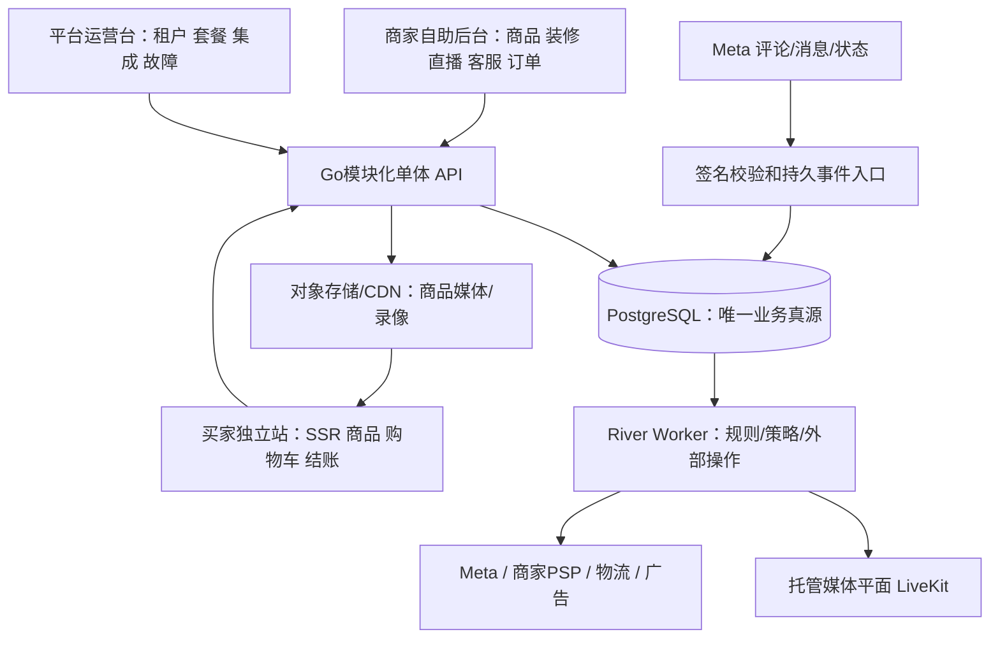

# 架构与择优决策

2026-09-20。**设计候选；不是已部署架构。** 延续原《架构.md》及不变量；新增需求须在 T01 纳入版本化合同后再实施。本轮没有改 OpenAPI、数据库迁移或客户配置。

## 1. 架构选择

按 ponytail ladder：交易/租户/库存的边界确有必要；原包已有 Go + PostgreSQL + River 设计，优先沿用，不重新引入另一套商业引擎；外部媒体/支付/物流使用受控供应商能力，不在十天内自造。

- API 与 Worker 是同一仓库的不同运行入口，不等于为每个业务模块建微服务。Web 使用原包 TypeScript strict、React/Next.js；Go 管交易逻辑，Node 不形成第二个订单/库存真源。
- PostgreSQL 事务内同时持久化领域事实和 River 任务，避免“双写一个成功一个失败”。媒体流不穿过交易 API；浏览器只拿受限媒体连接凭据，不拿 Meta/PSP 密钥。
- 分离三个 UI：商家后台、买家店铺、平台运营台；复用受控 UI 组件，不共用授权上下文。店铺前台按可信域名绑定解析店铺，未知 Host 失败关闭。
- 双后台完整页面/权限/租户生命周期见 [07专题](07-双后台与多商户隔离.md)。商家自带物流的tracking adapter与采购物流/建单分离；M15可接外部运单和多段轨迹，M22提供有权限的异步收货资料导出/运单回填，不因导出而改变财务/发货状态。
- Cloudflare DNS/CDN/WAF、对象存储、应用计算和 PostgreSQL 是不同资源。`xgdwm.com` 的 NS 在 Cloudflare 不意味着后端、数据库或媒体已部署。
- 候选生产拓扑：CDN → Web/API → 托管 PG，独立 Worker → 供应商；具体区域/机器/数据库预算和恢复目标在 T00 验证。不要仅凭原包候选版本宣称已锁定当前依赖。
- 台湾首发采用跨境承运商适配器：选店目录、门市编号映射、境外揽收/清关/台湾末端、物流单/代收对账分层。台湾本地物流或台湾出口接口不等于境外入台，见 [台湾专题](06-台湾超商选店与跨境履约.md)。
- 会话按[08专题](08-会话分域与业务架构调整.md)分域：identity登录、webchat站内买卖双方聊天、social外部渠道会话、support平台支持。共用PG/Go/客服布局不等于合并消息事实或授权；原泛化Conversation仅为旧职责草案，T01须按此细化，不能直接做万能消息表。

## 2. 模块归属与核心数据

|边界|拥有的数据/状态|可接受的调用，不允许的越界|
|---|---|---|
|identity/tenancy/stores|Tenant、Store、Membership、Role、DomainBinding、AuthSession|服务端导出可信作用域；登录session不是聊天，客户端 tenant_id/Host 不能授予权限|
|catalog/pricing|Product、SKU、PriceVersion、MediaAsset、PromotionRule|读者取得带版本报价；不能直接写库存余额或订单实付|
|inventory|StockLedger、Reservation、WarehouseStock|唯一库存写入口；订单、机器人、页面不得各自扣库存|
|live-commerce/claims|SalesActivity、KeywordRuleVersion、Offer、CommentIntent、Claim|将外部评论解析为业务意图；不能直接发钱/付款|
|live/media|LiveSession、Program、Destination、MediaAttempt、Recording|控制自有测试/授权直播；场次结束与媒体停止分开|
|integrations|Binding、CapabilitySnapshot、CredentialReference、InboundEvent、ExternalOperation|供应商差异集中在适配器；不把外部失败状态藏成成功|
|webchat|WebConversation、WebMember、WebMessage、WebReadCursor、WebAttachment、WebNote|本店买卖双方咨询与订单沟通；与Meta绑定、渠道正文、窗口和回执独立|
|social/messaging|SocialConversation、SocialMessage、OwnerGeneration、MessageIntent、EligibilityDecision、PrivateReplyBudget|仅渠道发送/接管；按provider和资产检验资格，不能给站内聊天套Meta窗口|
|inbox/read-model|带domain的会话引用、授权待办投影、客户/订单只读侧栏|界面/查询复用；按域路由具体命令，无万能发送或跨域自动转发|
|support|SupportTicket、SupportMessage|商家向平台求助；租户级支持权限不授予买家消息访问权|
|cart/checkout/orders/payments|Cart、CartRevision、Quote、CheckoutAttempt、Order、Payment、Refund、Reconciliation|结账协调库存和付款；PSP 钱归商家，不归 SaaS 商品资金池|
|fulfillment/customers/privacy|Package、Shipment、RMA、Customer、IdentityLink、Consent、DeletionJob|身份关联可撤销；收货信息/私信权限最小化|
|storefront|ThemeSchema、DraftRevision、PublishedRevision、Menu、Page|发布仅切配置引用；不能回滚支付/库存等历史事实|
|billing/reporting/migration|UsageLedger、Subscription、MetricProjection、ImportBatch、ExternalIdMap、CutoverEpoch|报表是投影可重建，不能成为第二份订单真源|

新增实体名是职责草案，不要求第一天生成所有表。每个持久对象须有租户/店铺归属、外部 ID 的平台作用域、版本、创建者/时间；同一名字不代表跨渠道同一身份。

## 3. 核心流程及状态

### 3.1 评论到新站付款

1. 官方渠道传入事件，执行适用的验签、大小/频率限制与绑定校验。Webhook：事务保存 `InboundEvent` 和待处理任务后才 ACK；SSE：没有逐事件 ACK 合同，需持久化已接收事件与读取检查点，断线后按官方可用能力重连/补拉去重。原始载荷按必要字段/保留期处理。
2. 根据确切 Page、LiveVideo/帖子、活动和规则版本解析，不扫描整个互联网评论；轮询补拉与 Webhook 用平台评论 ID 合流去重。
3. 生成 `CommentIntent`，校验商品/规格/价格、目标数量与活动规则；仅生成可重新确认的购物车。不因评论直接付款或默认锁货。
4. 创建对应短链与 `MessageIntent`；发送前再次核对绑定版本、会话所有者 generation、授权/窗口/用途、一次回复额度、规则停用状态。
5. 外部操作登记后调用 Meta。成功记录平台 ID；明确失败按分类处理；ACK 丢失进入 `UNKNOWN` 核对，不能用普通重试制造第二封首次私信。
6. 买家打开链接：GET 只读商品/非敏感预填意图。短链不能证明买家身份，不携带渠道 token/私密资料；修改已有买家购物车必须经过其会话授权，转发不能修改原买家资源。
7. 买家显式 POST checkout：服务端重算价格/优惠/税费/运费并原子预留库存。在线支付创建幂等支付尝试并验证PSP回调；COD则仅在承运商合同支持时创建待代收订单/收款安排，不能标记已付款。门市/跨境线路资格与运费在结账和出货前重验；处理重复/乱序/未知结果。
8. 订单、库存账本、付款、发货、退款状态分别保留事实；投影到活动漏斗与净额。外部同意/营销资格不从“已买过”推导。

### 3.2 必须稳定的幂等边界

|对象|候选唯一键/护栏|不能使用的替代|
|---|---|---|
|入站事件|供应商事件ID（如有）+资产绑定；评论实体按 Page+comment_id，变更另带版本/事件指纹|只按文本、时间或昵称去重|
|首次私密回复额度|平台+Page+comment_id 一次预算，加受控租户归属；App迁移/绑定轮换保留已消耗台账|把app_id、binding/token/rule/template版本放进“新一次发送”的唯一键；换App重新授额|
|交易意图|店铺+活动+平台评论实体+动作语义；编辑需要受控新版本|重复通知产生多个购物车/多笔订单|
|外部操作|业务操作ID+请求指纹+供应商可用幂等键；超时状态未知时先查询|HTTP重试等于 Exactly Once|
|库存/支付|原子库存约束、checkout/payment attempt ID、PSP事件ID|前端按钮禁用代替服务端约束|

我们只能控制本系统幂等，不能替 SHOPLINE 或另一 Meta App 保证全局去重。生产同一 Page/活动的自动化发送须明确唯一写者；旧自动化未知时不能贸然启用新发送。Page/租户重绑定需受控转移，不能借解绑重连刷新发送预算。

### 3.3 状态分离

- 渠道：`DISCONNECTED / AUTH_PENDING / READY / DEGRADED / REVOKED`，外加逐能力状态、探针时间和失败原因；不是一个绿色“已连接”覆盖全部功能。
- 销售活动：草稿/已发布/生效/暂停/结束；外部直播：准备/直播/结束/未知；两者不互相暗含生产操作。
- 消息：待评估/合资格/拒绝/发送中/已发送/未知/明确失败；送达与已读是不同证据，不凭成功 HTTP 推导。
- 上述发送资格/UNKNOWN是渠道出站状态；站内采用持久消息+参与者读游标+独立处理/分配状态。支持工单另有生命周期，不能复用Meta授权窗口。详见08第3–5节。
- 店铺装修：草稿→校验→预览→发布版本。发布时乐观并发校验，失败不替换在线版本；回滚仅引用已验证配置，不回滚交易事实。
- 域名：请求→所有权待验→TLS待就绪→可用→暂停/解绑；未知/失效绑定不落到默认租户。预览域名受权限控制并禁止索引。

## 4. Meta 官方合同与待测点

下表为 2026-09-20 官方资料核查，不是客户 App 已具备能力的证明。Facebook 与 Instagram 规则分别适配，不把 IG 的限制或字段搬给 FB。

|能力|官方接口/资格边界|实施/验收要求|
|---|---|---|
|创建 Page 直播|`POST /{page-id}/live_videos`；Page token、`pages_read_engagement`、`pages_manage_posts`，Live Video API 资格/审核等 [M04]|只在授权测试资产实测；现有生产直播本轮不操作|
|读取已有直播评论|授权后发现 LiveVideo ID；`/{live-video-id}/comments`，官方 streaming-graph `live_comments` 流 [M05]|“原生/SHOPLINE所建视频可被新App读取”需探针；不承诺任意视频可绑。服务器接流，不把token放浏览器|
|Webhook 接入|Facebook Page 使用 `feed` 等适用字段；逐Page `/{page-id}/subscribed_apps`；`pages_manage_metadata`及相应页面权限 [M06]|平台回调验证≠Page订阅≠直播评论已覆盖。核对feed真实样本；必要时官方读取补拉|
|评论/页面资产权限|发现Page常需`pages_show_list`，读取相应Page内容按端点核对`pages_read_engagement`/`pages_read_user_content`|每项最小权限+Page任务+访问级别+真实探针矩阵；不用一个管理员身份假装全部通过|
|首次私密回复|`POST /{page-id}/messages`，recipient 指定comment_id/post_id；`pages_messaging`、有MESSAGING任务的Page token；每个合资格评论/帖子一次，通常在创建后7天内 [M01]|Facebook文档规则；其他Page作为作者等限制须遵守；顾客未回应不获得普通24h窗口。Live兼容仍需测试|
|普通 Messenger 会话|用户合资格互动打开的标准24h窗口；发送前重验 [M02]|公开评论不等于普通会话开启；供应商UI“7天”不是自动营销许可|
|窗外 Utility|经批准且符合非营销用途的交易性模板 [M03]|不用于推广/弃购催单绕窗；权限名称以客户Dashboard与当前API合同核对，单复数字样不猜。Human Agent不用于机器人|
|多商户接入|Facebook Login for Business、每商户授权与资产选择；外部用户通常涉及Advanced Access/App Review、Business Verification；Tech Provider另有Access Verification [M07–10]|一个合格App可服务多个商户，不必每店一个App；三类验证不互相替代，也不保证十天获批|

令牌成功、Webhook 验证成功、测试员成功、App 发布、企业验证通过都不能互相替代。客户 App ID 以实时后台只读核对为准；不得复用本会话旧 Daerdo App 的权限结论。

官网来源：

- M01 [Messenger Private Replies](https://developers.facebook.com/documentation/business-messaging/messenger-platform/discovery/private-replies)
- M02 [Messenger Platform Policy](https://developers.facebook.com/documentation/business-messaging/messenger-platform/policy)
- M03 [Utility Messages](https://developers.facebook.com/documentation/business-messaging/messenger-platform/send-messages/utility-messages)
- M04 [Live Video Streaming](https://developers.facebook.com/documentation/live-video-api/guides/streaming)
- M05 [Live Video Comments / Interact with Viewers](https://developers.facebook.com/documentation/live-video-api/interact-with-viewers)
- M06 [Webhooks for Pages](https://developers.facebook.com/documentation/pages-api/webhooks-for-pages)；[Page subscribed_apps](https://developers.facebook.com/docs/graph-api/reference/page/subscribed_apps/)
- M07 [Facebook Login for Business](https://developers.facebook.com/documentation/facebook-login/facebook-login-for-business)
- M08 [App Review Submission Guide](https://developers.facebook.com/documentation/resp-plat-initiatives/individual-processes/app-review/submission-guide)
- M09 [Business Verification](https://developers.facebook.com/documentation/development/release/business-verification)
- M10 [Access Verification](https://developers.facebook.com/documentation/development/release/access-verification)

## 5. 现有合同与新增接口面

原 `contracts/core-openapi.json` 的 checkout、退款、发货、接管、直播启动、广告发布和操作查询保持为基线。补充接口先作为 T01 候选，不冒充已实现 API。

|接口面|应纳入的合同|强制控制|
|---|---|---|
|自助商家/店铺|建店、邀请、开店就绪检查、域名验证|可信租户、权限、配额、审计|
|商品/词库|商品SKU CRUD、导入校验、词冲突、规则模拟/发布|版本和乐观锁；发布不可默默影响活动快照|
|装修|读取/编辑草稿、preview、validate、publish、rollback|安全schema、角色、版本差异；回滚不碰资金|
|渠道/活动|OAuth开始/回调、Page选择、能力探针、已有LiveVideo绑定、活动发布|CSRF/state、token服务器保存、精确资产及能力门禁|
|评论/消息|签名事件接入、流/补拉、意图/失败查询、单条受控发送|有限重试、用途窗口、一次额度、未知核对|
|站内聊天|买家建会话/消息/附件/已读；商家分配/回复/备注；独立REST+SSE|参与者/订单鉴权、幂等、断线恢复；不依赖Meta；08的CS门禁|
|客服聚合/平台支持|按权限读待办投影；平台支持工单独立入口|聚合不授予写权限；支持人员无默认买家消息权|
|迁移|预览映射、校验、导入批次、失败报告、批准切换检查|不覆盖既有事实；先快照、再写、可读回及补偿|

所有公开可写接口需外部输入验证、身份/对象级授权、请求幂等、审计和限流；支付/退款等额外执行原门禁。文档操作名称不是授权去调用客户后台。

## 6. 按模块择优的决策记录

|决策|选择与理由|未采用的方案|验收 / 升级信号|
|---|---|---|---|
|ADR-D01 交易底座|沿用Go模块化单体+PG+River，交易原子边界清楚，适合紧凑团队|照猜竞品微服务；第二库存/订单引擎|G03–05/G12；实测隔离或扩展瓶颈才拆服务|
|ADR-D02 商品和装修|采用竞品成熟自助流程，原固定模板升级为受控区块配置/版本发布|只能开发者改首页；任意JS/插件市场|商家独立完成装店，发布/回滚/移动端G11；有明确表达需求再扩区块|
|ADR-D03 关键词|永久词库+活动覆盖+模拟器；保留精确解析并显式提供兼容策略|无边界substring命中；默改数量为增量|误单负例G03/G07；实际样本支持后才放宽|
|ADR-D04 库存|默认显式POST结账预留，评论仅意图|未经批准复制评论即锁货|刷评论不占库存；若真实业务要排队锁货，另定TTL/上限/反滥用/公平规则并过G03，不暗中改不变量|
|ADR-D05 直播接入|经营活动与媒体解耦，已播视频先只读能力测试，媒体用托管平面|强迫客户关播重开以接管；自建转码集群|测试资产G06；供应商成本/容量超限再评估替换|
|ADR-D06 消息流程|借鉴模板预览/人工接管/侧栏，用我们集中策略与操作台账|照抄旧7天窗口/过期tags；自动机器人冒用Human Agent|G07：资格负例、重复/未知不多发；规则变化要更新证据|
|ADR-D07 新店交易|本系统承接商品、购物车、订单、结账和商家PSP；旧系统作为迁移来源|急需功能完成却仍回跳SHOPLINE结账|G05/G11真实交易与退款，新站订单读回|
|ADR-D08 性能比较|内部用可复现基准，对竞品仅比较可观察步骤/延迟/故障可见性|猜测语言/架构优劣；在客户后台压测|G12/G15；同硬件/数据/负载/成本和正确性下比较|
|ADR-D09 会话分域|webchat/social/support/identity独立事实与授权，共享工作台组件、交易服务及PG/River底座|万能消息表；站内行为延长Meta窗口；失败自动换渠道；未经测量拆IM微服务|08的CS01–CS14；明确新需求或实测容量瓶颈才新增协议/服务|

所有“选择”是本次设计建议，与用户明确边界一致；改变原不变量的候选（如评论锁库存）尚未采纳。不要以未测性能为理由宣称 Go 比竞品快。

## 7. 性能、部署与恢复

原包负载预算保留为**待校准候选**：L1=200租户数据、20场业务直播、500评论事件/秒、50checkout/秒、1000后台SSE；L2=2000事件/秒10秒突发、重复乱序429、单租户80%流量；L3=API/Worker/PG重启、媒体断连和外部ACK丢失。

候选指标：持久入口ACK P95≤200ms/P99≤500ms；入口→意图P99≤1500ms；常规读P95≤200ms。外部网络/Meta送达/支付耗时单独报告，不混入本机算法性能；媒体带宽不等同评论吞吐。固定测试硬件、数据集、区域、连接数、样本与成本再判定，不在客户系统压测。

装修/商品缓存键包括可信店铺、市场、币种、语言及目录/模板revision；跨租户不能共享个性化响应。订单/库存/消息资格不以过期缓存作最终判定。先观察慢查询、任务积压和分租户公平性，再决定是否需要缓存或独立服务；不用新中间件掩盖正确性缺陷。

故障恢复要求：数据库备份实际恢复；失败任务能重放而不重复外部副作用；token撤销即时阻止相关发送；轮询游标/流断线补拉保留检查点；交易迁移和部署有兼容窗口。RPO/RTO与服务等级必须冻结，未测试前不报可用性百分比。

## 8. 迁移与上线隔离

1. **准备**：授权后的商品/客户/订单导出快照，字段映射与来源日期；本轮未导出客户数据。隔离环境和测试Page/测试PSP，不用现有买家做负例。
2. **演练**：导入dry-run、幂等重放、数量/金额校验；新域名预览仅内部。历史订单不重付；不可迁移密码/授权/营销同意要单独处理。
3. **读影子**：仅在另获授权与访问资格后读取；新系统外部发送/扣款/库存写均禁用，不影响SHOPLINE继续经营。不能把影子验证算作生产发送成功。
4. **切换准备**：客户批准库存截止点、未完成订单责任、新单归属、发送唯一写者和安全时间；不能擅停正在播的视频。旧链接/已发购物车和未结账订单如何处理必须登记。
5. **一次切换**：经批准才关闭对应旧自动化写入、刷新库存/价格、启用新发送/收款和域名；读回新站真实订单/付款、库存、消息与退款。旧直播是否继续由客户控制，不能为切换自行停播。
6. **回滚**：停止新业务写入口之前先保护已付款订单和在途外部操作；明确新旧账务/库存同步。恢复旧入口不重复收款、不丢新单；DNS不是完整回滚。

已有授权只覆盖本轮只读调研及本地文档，以上生产迁移均是未来审批流程，不在本轮执行。
