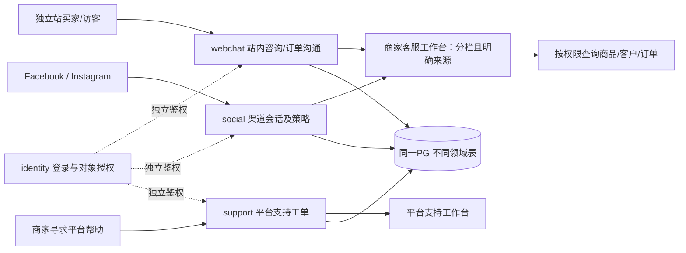
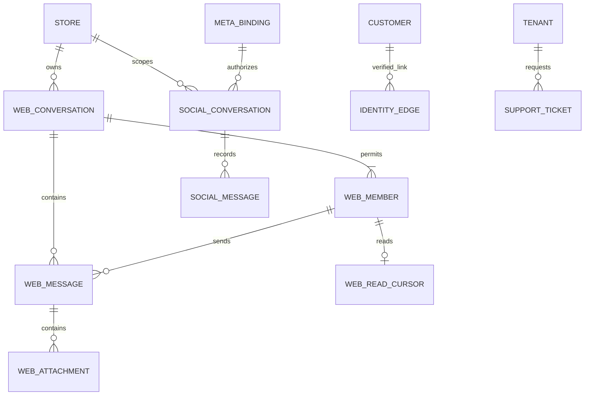

# 会话分域与业务架构调整

2026-09-20 · **DESIGN / NOT_RUN_PRODUCT**。本轮按用户明确要求修订：SaaS 原生会话与 Meta 渠道会话必须分开。只调整本发现包，尚未冻结原 JSON/OpenAPI 合同、生成数据库迁移或实现收发。

## 1. 核查结果与优化目标

目标来自用户：按真实商家业务补齐站内买卖双方聊天，分清渠道边界，复用必要能力，避免重复建设；不得影响现有直播和营业。

|核查对象|可复核现状|暴露的缺口|
|---|---|---|
|原数据库设计|原《架构.md》§6/18 有租户、14组表、复合键、索引/事务/RLS/迁移原则|没有实际 SQL、迁移、ERD；23任务未开始，15产品门禁未测，不能称数据库实施齐全|
|原消息设计|§10/16 有 Meta 绑定、消息资格、幂等、接管；03原用泛化 Conversation/统一发送|不足以表达独立站原生聊天；认证会话、站内消息与渠道会话易被误合并|
|商家真实后台 E11|本轮只读确认消息工作台、订单设置、顾客设置、自订消息内容分别有入口|没有打开顾客对话，不知道该店具体消息量、响应时延或实际使用比例|
|真实店铺 E12|后台“进入我的商店”指向 jieshop.co；首页“联络我们”打开邮箱+留言+发送表单|未填、未提交；仅证明咨询入口，不证明即时双向聊天或消息已进入后台|
|官方流程 S04/S20|官网消息与社群消息、贴文评论分区；客服操作结合顾客/订单和手工单|可借鉴业务分工；不能推断 SHOPLINE 内部数据库、语言和性能|

本轮测量是**覆盖核查**：现有一个泛化消息域，未找到完整独立原生聊天合同；不是性能基准。优化收益先以 CS01–CS14 的功能/隔离门禁判定。吞吐、成本、客服耗时改善均未测，不给虚构百分比。

来源：[S04 消息中心总览](https://support.shoplineapp.com/hc/zh-tw/articles/16513733305369)、[S20 即时消息与手工单](https://support.shoplineapp.com/hc/en-us/articles/900002445466)；现场证据见 [01](01-后台证据与来源.md)。下述表、接口和状态均为**我们的设计**，不是竞品实现披露。

## 2. 四种会话，分别负责

|域|双方 / 真源|身份和权限|不得混用|
|---|---|---|---|
|认证登录会话 `identity`|平台员工、商家员工或买家与认证服务；本地 session/IdP|受众、主体、租户/店铺范围、期限和撤销|不是聊天；Meta OAuth 成功不是本地买家登录，也不赋予商家员工权限|
|站内买卖双方聊天 `webchat`|买家/访客 ↔ 该店客服；本系统 PG 消息事实|店铺访客票据或已验证买家身份，客服店铺权限/分配|不使用 Page token，不受 Meta 窗口控制，不因 Meta 断开而失效|
|外部渠道会话 `social`|Facebook/Instagram 用户 ↔ 精确 Page/IG 资产；本地记录与平台回执各自留源|平台作用域身份、资产绑定、授权版本、发送资格|不是站内会话；站内发言/已读/下单不能刷新 Meta 资格或伪造其回执|
|平台支持工单 `support`|商家 ↔ SaaS 平台支持；本系统工单|租户级支持权限、受控支持授权；平台人员身份明确|不复用买家客服会话；看支持工单不获得买家正文/地址访问权|

公开评论是 `social_comment` 事件/对象，不伪装成 DM。评论可触发合资格的首次私密回复，但不能因此合成已建立的普通私信会话。

这里的域是**模块和数据所有权**，不是四个微服务或四套数据库。首版继续一个 Go 模块化单体、同一 PG、现有 River 和受控对象存储。

## 3. 按商家业务重排流程

### 3.1 买家在独立站咨询与售后

1. 商品页/首页提供“联系店铺”，订单详情提供“联系商家”。二者共用 `webchat`，以 `general/order` 类型区别上下文，不再造两套聊天引擎。
2. 服务端从可信店铺域名和会话识别范围。游客可咨询商品；输入邮箱不等于验证身份。订单聊天必须另证该买家对订单的访问权，猜订单号/转发购物链接不能读取订单。
3. 建立本店 `WebConversation`，保存参与者、商品/订单引用。客服看到来源“网站”，分配、回复、待跟进/完成/归档；不得把内部备注显示给买家。
4. 发送消息先事务持久化，再推送变化；离线仍保存，可稍后回来读取。首版文本+受控图片，含发送失败重试、未读和断线续读。邮件只作获准的通知通道，不复制完整私信，通知成功不等于买家已读。
5. 访客登录只在证明原访客会话所有权且无冲突后关联本地客户。跨设备恢复需重新验证；退出或票据过期立即停止原流权限，不能靠猜 conversation_id 恢复。

### 3.2 FB 直播/私信导购

1. 商家绑定精确 Page/IG 资产；入站按 provider/app/asset 路由，无法唯一确定店铺则隔离，禁止广播到多店。
2. 评论→购买意图→一次合资格链接回复，或既有渠道私信→客服回复；走 `SocialConversation`、渠道策略、`ExternalOperation`，不走站内写消息接口。
3. 客服可调用同一个商品查询/报价/草稿购物车服务，但发送仍指定原渠道及资产。不能用工作台“统一发送”在后端猜渠道。
4. 买家到新站后是独立站访问者；只有证明身份才建立可撤销关联。可显示“有关联的订单/其他渠道会话”，但不拼成无来源的混合正文，也不自动双向转发。
5. Meta 撤权仅停止相关渠道操作；站内订单、聊天和售后继续。渠道发送失败不能偷偷改走站内消息、邮箱或另一 Page。

### 3.3 客服工作台可以合并什么

共用导航、待办布局、客服分配组件、商品选择器、客户/订单侧栏、快捷短语编辑器和审计基础。网站、Facebook、Instagram 有明确页签/来源徽标；“全部”仅为经过逐项授权的任务列表，点击后进入单域会话，输入框显示确定的目标与可发送原因。

处理状态、客服本地已读、买家站内已读、平台送达/已读回执、机器人接管和消息发送资格分别记录。不能“点已完成”就标买家已读，也不能打开列表就向 Meta 发已读指令。备注分为**会话内部备注**与**客户资料备注**，都不作为对外消息；删除/保留权限各有范围。

平台支持只复用布局和工单基础，不并入商家买家收件箱。首版不额外自造企业即时通讯，支持工单满足后台求助即可。

## 4. 数据库修订：独立事实，受控关联

以下为 T01 待冻结的最小字段/键草案；不是已创建的表。所有店铺私有表都有 `tenant_id, store_id, id, created_at`，可变对象另有 revision/updated_at；关联目标使用同作用域复合外键。租户级平台支持表不强行绑定某个 store。

|表组/对象|主要字段/约束草案|必需访问路径|
|---|---|---|
|认证 `auth_sessions`|audience、principal/customer/guest 引用、expires_at、revoked_at、authz_revision；凭据只存安全摘要/引用|主体的有效会话；认证 token 不复用为 Meta token|
|站内 `web_conversations`|kind、status、assigned_principal_id、assignment_revision、next_seq、last_message_at；order_id可空且同店|`(tenant,store,status,last_message_at,id)`；分配客服索引|
|站内 `web_conversation_members`|member_id为成员行ID；conversation_id、buyer_actor_id/guest_actor_id/staff_principal_id三列可空引用；`CHECK num_nonnulls(...)=1`；加入/撤销时间|成员行复合键`(tenant,store,conversation,member_id)`；三类主体分别有`(tenant,store,conversation,subject_id)`的非空partial UNIQUE及同作用域FK，防止同主体重复加入；重新加入恢复原成员行并审计|
|站内 `web_messages`|conversation_id、sender_member_id、server_seq、client_request_id、request_digest、body/type；`(tenant,store,conversation,sender_member_id)`复合FK到成员行，执行时校验仍有效|`UNIQUE(tenant,store,conversation,server_seq)`；`UNIQUE(tenant,store,conversation,sender_member_id,client_request_id)`，异内容同键拒绝|
|站内 `web_read_cursors`|conversation_id、member_id、last_read_seq；复合FK到同作用域会话成员；仅本人显式推进且不超过其可见持久消息序号|`UNIQUE(tenant,store,conversation,member_id)`；未读从持久消息与游标计算，不拿社交回执覆盖|
|站内 `web_attachments`|message_id、private_object_ref、type/size/hash、scan_status、retention_until|复合FK到消息；只读到同会话成员，扫描就绪前不可外发/预览|
|站内 `web_notes`|conversation_id、staff_principal_id、body、revision|仅有客服备注权限可读；与消息/客户备注分别保留|
|渠道 `social_conversations/social_messages`|provider、external_asset_id、external_thread_key、platform_actor_scope、binding_id、binding_semantic_version、provider_message_id；正文/回执保留来源|conversation identity由provider适配器定义并冻结；外部消息按provider+资产+消息ID去重，不能按文本|
|渠道状态/发送台账|social_read_state、owner_generation、MessageIntent、EligibilityDecision、PrivateReplyBudget、ExternalOperation及尝试|绑定撤销/换资产使旧动作失败关闭；令牌轮换不重置业务幂等和首次回复预算|
|身份关联 `identity_edges`|本店customer、精确provider/asset范围actor、验证证据、目的、有效期、撤销|沿用原§14，不复制客户表；关联不是授权继承，也不是消息搬家|
|平台支持 `support_tickets/support_messages`|tenant、商家成员/平台支持作者、status、assignee、revision、附件权限|租户+状态/更新时间；平台人员访问记录可审计，无默认买家资料权|

重要约束：

- `web_*`、`social_*`、`support_*` 不以一个 `messages(channel,text,any_user_id)` 万能表承载全部权限；物理表名/SQL schema 在 T01 冻结。同 PG 不等于无边界互读。
- 站内消息追加在一笔短事务内：校验参与者/分配 → 锁会话计数行并分配序号 → 消息及持久 UI 事件/必要通知任务一起提交。重试读回同一消息；事务中不等待外部 API。
- 外部渠道的迟到消息/状态事件单独去重合并；本地排序序号不冒充平台因果顺序。已读回执仅在 provider 有证据时展示。
- 对当前资产路由建唯一有效归属约束；换绑、授权 epoch 与普通 secret 轮换分开。历史消息保留原租户范围，新租户不得因重新绑定资产继承旧买家记录；首次回复已消费事实按原03规则受控保留，不能换绑重发。
- RLS 使用普通 runtime 角色和事务作用域；成员/客服分配检查仍在服务层。表 owner、迁移角色、后台任务不绕过业务授权。全局路由索引无消息正文/地址。
- 附件、搜索、未读计数、SSE、导出和删除一并按域/租户/店铺授权；搜索结果或计数也不得泄漏无权会话。私密附件不进入商品公共 CDN。
- 保留、隐私导出、删除按域和目的配置。关联边撤销后停止跨域侧栏查询，不自动删财务事实；恢复后重放撤销/删除墓碑。

图仅表达关系方向；复合键、空值/生命周期和身份关联的精确 FK 必须落实成 T01 数据字典/迁移审查。**整个电商数据库的全表字段、索引DDL和RLS SQL仍未交付**，本专题不能替代它们。

## 5. API 与实时边界

以下路由是候选合同，必须先进入 T01，再由实现消费；不要直接按名字调用线上系统。

|入口|负责的命令/查询|限制|
|---|---|---|
|`/storefront/chat/...`|站内建会话、分页历史、发消息、本人已读游标、附件受控上传|可信店铺域、访客/买家认证、CSRF、输入大小/频率、会话参与者与订单权限；无Meta凭据|
|`/merchant/web-conversations/...`|客服分配/接管/恢复、回复、内部备注、完成/重开|有店铺权限且满足分配/assignment_revision；抢占或撤权使排队回复失效|
|`/merchant/social-conversations/...`|读取渠道消息、接管、创建渠道发送意图|明确binding/provider/asset/owner_generation；发送瞬间重验当前资格及用途|
|`/integrations/meta/webhooks/...`|验签、持久入站、确定资产路由|不接受任意body tenant作为授权；不作为站内消息入口|
|`/merchant/inbox`|只读跨域待办投影|返回带类型的引用和来源；逐项对象授权，无万能发送端点|
|`/support/tickets/...`|商家求助与平台客服回复|独立受众/角色，不能用商家token访问平台管理动作|

实时复用现有 REST+SSE：POST发消息，SSE只推可见变化。买家流、商家站内流、社交流、平台支持流具有不同受众和主题；重连cursor签名/绑定范围，撤权立即失效，超期回到授权快照。连接慢/断开不丢已持久消息，PG NOTIFY仅作唤醒，不是真源。没有已测必要性，不为聊天额外引入 WebSocket 集群、Kafka 或另一套消息库。

## 6. 保留、合并与暂不增加

|裁决|内容|理由 / 增加复杂度的信号|
|---|---|---|
|必须补齐|原生网站咨询/订单聊天；Meta单独收件箱；平台支持工单边界|新站是成交和售后真入口，不能依赖第三方消息资格|
|必须保留|租户隔离、可信身份、显式接管、消息幂等、付款/库存独立事实|这是正确性，不是可裁剪冗余|
|合并实现|网站通用咨询与订单咨询一个webchat模块；商品/报价/购物车/订单服务只保留一份|区别上下文，不复制交易真源；客服草稿单仍需买家确认和独立资金门禁|
|合并界面/基础能力|客服工作台布局、侧栏、快捷短语编辑器、审计、队列、SSE基础设施|读投影共享，写命令和授权仍分域；不强迫商家重复维护商品/订单|
|不合并|登录session、站内chat、Meta会话、平台support；买家消息与内部备注；渠道资格与处理状态|语义、参与者、凭据和隐私目的不同|
|暂不新增|独立IM微服务、聊天专用数据库、全渠道万能机器人引擎、群聊/语音通话/已输入动画|没有当前业务证据；出现明确需求或实测连接/存储瓶颈后另立ADR，不删除既有明确功能|
|不照搬|竞品所有平台/POS/无限建站器、外部旧窗口文案、按昵称合并、为了接入而停播|菜单不等于需求/权限；保持用户已有完整SaaS范围与生产连续性|

预期收益为结构性：Meta故障不拖累站内售后；商家少维护一套商品/订单；域间不误发、不串读。正式测量应比较相同任务（咨询→找商品→发链接→查单）的页面切换/人工步骤、错误率、消息持久化与恢复延迟，以及单租户洪峰对结账的影响；本轮没有这些实绩。

## 7. 新增需求、实现顺序及验收

- **FR-CHAT-01**：站内买卖双方咨询、订单沟通、离线保留、附件、客服分配/未读/接管完整闭环。
- **FR-CHAT-02**：认证/网站/社交/平台支持分域；共享工作台只读投影及受控客户订单关联；Meta不可用不阻断站内。
- 映射：M01/M02/M08/M09/M12/M16/M21；T01冻结两类消息与支持合同及SQL约束 → T02/T03共同基础/隔离 → T05买家入口 + T09站内客服子任务 → T06/T07独立渠道适配 → T14身份隐私 + T18工作台 → T20/T21/T22验收。
- 原T09偏直播工作室，T01必须登记站内聊天子任务，不能让它依赖Meta获批。原23任务状态保持不变；新增工作需重估10天排程，不能用“复用”掩盖工期。

|ID|测试输入|通过条件与门禁（全部 NOT_RUN_PRODUCT）|
|---|---|---|
|CS01 分域|同一顾客同时网站咨询、FB DM并让商家发平台工单|三个ID/消息集合/授权独立，登录session无聊天正文；G01/G02/G09|
|CS02 无Meta营业|Meta未绑定/过期/撤销时网站询问与订单售后|站内双向收发正常，Meta动作明确阻塞；站内行为不改变渠道资格；G07/G11|
|CS03 越权及成员完整性|换tenant/store/conversation/member/order/附件ID；同主体重复加入、同时填两类主体、引用其他会话成员|API、真实PG runtime、worker、流、投影/计数逐层拒绝；成员CHECK/partial UNIQUE/复合FK负例实际失败；G01/G02|
|CS04 访客与订单|输入他人邮箱、转发链接、猜单号、访客登录/跨设备恢复|无自动身份合并/订单泄漏；合法验证后才关联；G02/G09|
|CS05 发送幂等|重复POST、提交后断连、同幂等键不同内容|一个持久消息；异内容冲突；消息和UI事件原子提交；G04|
|CS06 断线恢复|断SSE、乱序唤醒、过期cursor、慢客户、断权|无丢失/串域；去重补读或授权快照，内存有界；G01/G04/G12|
|CS07 接管竞态|两客服接管、分配变化后旧回复/机器人任务晚执行|旧generation拒绝；恢复显式；内部备注零对外；G04/G07|
|CS08 已读语义|读列表、标完成、站内已读、收到平台送达回执|四者不相互伪造；未授权不发外部已读动作；G07/G09|
|CS09 关联/换绑|同昵称、手机号、不同Page actor、资产换商家、关联撤销|不自动合并正文/身份；无历史跨租户泄漏；预算不重置；G01/G07/G09|
|CS10 附件/恶意内容|超大/伪类型文件、脚本、私密对象URL、过期下载|限制/清洗/扫描/授权有效，正文与附件无公开泄漏；G02/G09|
|CS11 侧栏交易|聊天选商品、改数量、草稿单/超商选店、旧报价|复用正式报价/库存/订单服务，买家确认，零双订单/伪付款；G03/G05/G08/G11|
|CS12 支持/隐私|平台支持超范围、导出、删除、备份恢复|无默认买家消息权；各域保留与墓碑有效；G01/G09/G12|
|CS13 公平性|站内聊天洪峰叠加直播评论与checkout|先冻结站内消息/s、活跃会话、连接数、正文/附件大小及预算；测P95/P99和资源/公平性，不能借用评论负载作聊天验收；G12/G15|
|CS14 生产无干扰|新系统试验期间旧系统营业|仅隔离测试资产产生消息；零生产写/已读/停播/重复私信；切换按批准窗口；G14|

文档退出条件：分域定义、字段/约束候选、业务流程、接口归属、取舍、任务/门禁映射可审查且无未解决P0/P1。产品退出条件另需真实PG、UI及获授权的渠道测试；缺少外部资格可继续站内开发，但不能声称Meta已可营业。
